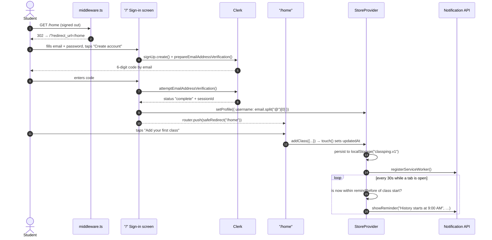
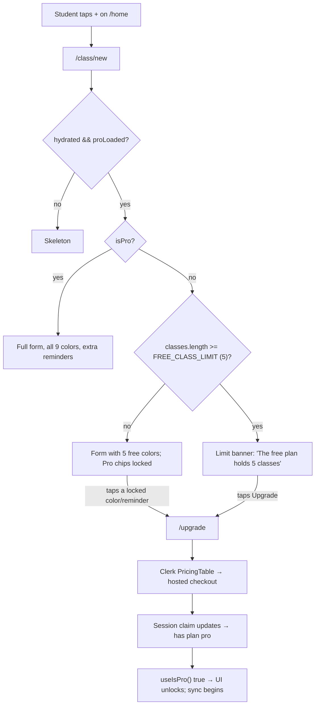
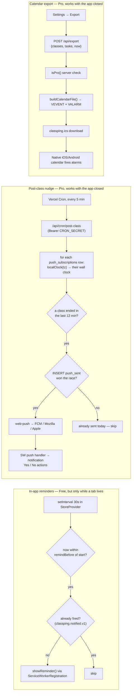
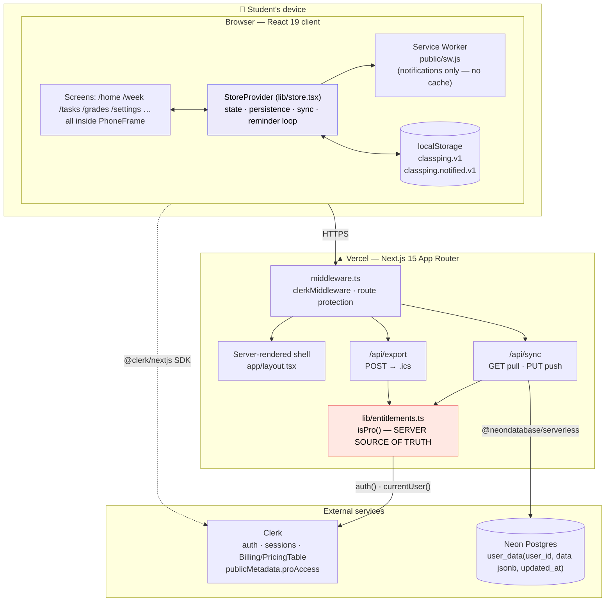
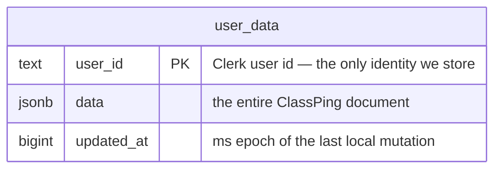
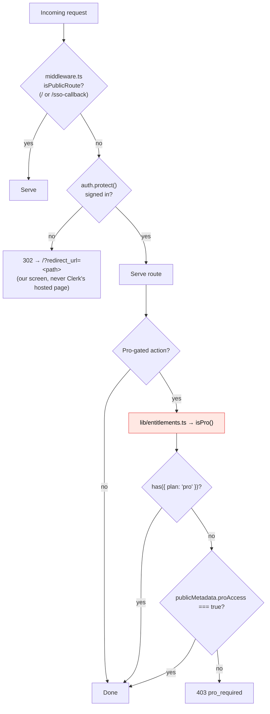
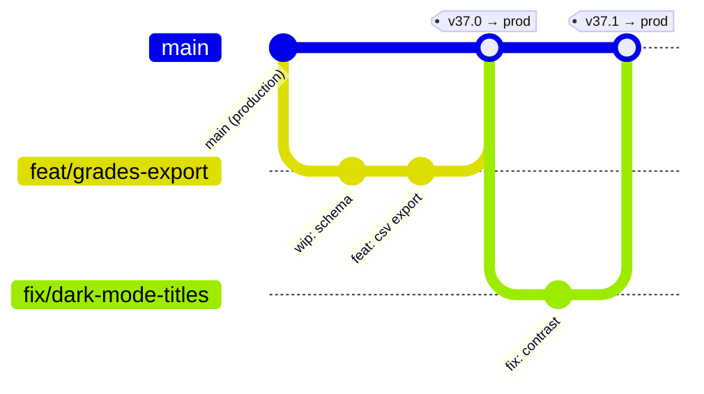

# ClassPing — Engineering Handbook

> Internal technical reference and operations manual.
> Audience: a newly onboarded engineer who needs to understand how ClassPing works and how to change it without breaking anyone's schedule.

**App:** ClassPing — *"Your classes and deadlines, right on time."*
**Purpose:** A mobile-first PWA for students. Plot your Mon–Fri timetable, get pinged before class starts, log assignments the moment a class ends, track grades/GPA, and keep nagging reminders until things are done.
**Stack:** Next.js 15 (App Router) · React 19 · TypeScript 5.7 · Tailwind CSS v4 · Clerk (auth + billing) · Neon Postgres (serverless driver) · Vercel (hosting).

---

## Table of Contents

- [Section 0: Orientation](#section-0-orientation)
- [Section 1: Functionality & User Workflows](#section-1-functionality--user-workflows)
- [Section 2: Architecture & Component Breakdown](#section-2-architecture--component-breakdown)
- [Section 3: Versioning, Updates & Maintenance SOPs](#section-3-versioning-updates--maintenance-sops)
- [Appendix A: Known Issues & Tech Debt](#appendix-a-known-issues--tech-debt)
- [Appendix B: Glossary](#appendix-b-glossary)

---

## Section 0: Orientation

### The one paragraph that explains everything

**ClassPing is a local-first app with a thin cloud layer bolted on.** All user data — classes, tasks, grades, profile — lives in the browser's `localStorage` under a single key (`classping.v1`) and is held in one React Context (`lib/store.tsx`). The app works fully offline and signed-out-of-the-cloud. On top of that, two server routes exist, and **both are Pro-only**: `/api/sync` (mirror the whole document to Postgres so it follows you across devices) and `/api/export` (turn the document into an `.ics` calendar file). If you internalize "the client owns the data, the server is an optional mirror," almost every design decision in this codebase follows.

### Repo map

```text
classping/
├── app/                     # Next.js App Router — every route is a screen
│   ├── page.tsx             # "/"  Sign in / Sign up (the only public screen)
│   ├── home/                # Today's schedule, assignments, class list
│   ├── week/                # Mon–Fri time-grid timetable
│   ├── tasks/               # Assignment list + /tasks/new
│   ├── grades/              # PRO — grades & GPA + /grades/new
│   ├── class/new/           # Add class
│   ├── class/[id]/edit/     # Edit class
│   ├── settings/            # Profile, theme, accent, calendar export, sign out
│   ├── upgrade/             # Clerk <PricingTable /> paywall
│   ├── prompt/              # Post-class "did this come with an assignment?"
│   ├── lock/                # Lock-screen reminder mockup
│   ├── sso-callback/        # Clerk OAuth landing (public)
│   ├── layout.tsx           # ClerkProvider > StoreProvider > children
│   ├── manifest.ts          # PWA manifest (generated by Next)
│   └── api/
│       ├── sync/route.ts    # PRO — GET pull / PUT push the whole document
│       ├── export/route.ts  # PRO — POST returns text/calendar (.ics)
│       ├── push/subscribe/  # PRO — register/unregister a device for Web Push
│       └── cron/post-class/ # CRON — the after-class nudge (Bearer CRON_SECRET)
├── lib/
│   ├── store.tsx            # ⭐ THE CORE. State, persistence, sync, reminder loop
│   ├── db.ts                # Neon client + ensureSchema()
│   ├── entitlements.ts      # ⭐ SERVER source of truth for Pro
│   ├── useIsPro.ts          # CLIENT Pro check — UI only, never a real gate
│   ├── plan.ts              # PRO_PLAN slug, FREE_CLASS_LIMIT
│   ├── calendar.ts          # RFC 5545 .ics builder
│   ├── notifications.ts     # SW / Notification wrappers + push subscribe
│   ├── push.ts              # SERVER — VAPID send, prunes dead subscriptions
│   ├── time.ts              # fmtTime + localClock() — shared client/server
│   ├── gpa.ts               # Weighted class average + 4.0-scale GPA math
│   ├── palette.ts           # Subject colors (5 free, 4 Pro)
│   └── accents.ts           # App accent themes (1 free, 4 Pro)
├── components/              # PhoneFrame, TabBar, ColorPicker, Skeleton, …
├── middleware.ts            # Clerk route protection (/api/cron/* is exempt)
├── vercel.json              # Cron: /api/cron/post-class every 5 min
├── public/sw.js             # Service worker — caching + push + notif actions
└── scripts/
    ├── check-db.mjs         # One-off DB connectivity check
    └── generate-vapid.mjs   # One-off VAPID keypair generator
```

### Local setup

```bash
npm install
cp .env.local.example .env.local   # ⚠️ does not exist yet — see below
npm run dev                        # http://localhost:3000
```

Required environment variables:

| Variable | Where it's used | Notes |
| --- | --- | --- |
| `NEXT_PUBLIC_CLERK_PUBLISHABLE_KEY` | Client (Clerk SDK) | Safe to expose. |
| `CLERK_SECRET_KEY` | Server (`auth()`, `currentUser()`) | **Secret.** |
| `NEXT_PUBLIC_CLERK_SIGN_IN_URL` | Clerk redirects | Set to `/`. |
| `NEXT_PUBLIC_CLERK_SIGN_UP_URL` | Clerk redirects | Set to `/`. |
| `NEXT_PUBLIC_CLERK_SIGN_IN_FALLBACK_REDIRECT_URL` | Clerk redirects | Set to `/home`. |
| `NEXT_PUBLIC_CLERK_SIGN_UP_FALLBACK_REDIRECT_URL` | Clerk redirects | Set to `/home`. |
| `DATABASE_URL` | `lib/db.ts` | Neon Postgres, provisioned via Vercel Marketplace. **Optional** — if unset, `sql` is `null` and `/api/sync` returns `503`; the app still runs. |

Sanity-check the database with `node scripts/check-db.mjs` — it creates the `user_data` table if needed and prints the row count.

> **Onboarding gotcha:** the checked-in `.env.local` contains a commented-out *and* a live copy of the Clerk keys. Read to the bottom of the file. There is no `.env.example` in the repo; creating one is a good first PR.

---

## Section 1: Functionality & User Workflows

### 1.1 Core features

| Feature | Route(s) | Plan | Description |
| --- | --- | --- | --- |
| Email + password auth | `/` | Free | Clerk sign-in/sign-up with a 6-digit email verification step. |
| Google OAuth | `/`, `/sso-callback` | Free | `authenticateWithRedirect` → SSO callback → `/home`. |
| Today's schedule | `/home` | Free | Greeting, day-navigation pill, class cards, open assignments, class list with edit/delete. |
| Week timetable | `/week` | Free | Computed Mon–Fri time grid with a live "now" line. |
| Add / edit class | `/class/new`, `/class/[id]/edit` | Free (≤5 classes) | Day picker, start/end times, reminder lead time, alarm toggle, color. |
| Assignments | `/tasks`, `/tasks/new` | Free | Open ↔ Done filter; tap to complete. Due-in presets, daily reminder toggle. |
| Post-class prompt | `/prompt` | Free | "Did this class come with an assignment?" → pre-filled Add Assignment. |
| In-app reminders | (background) | Free | 30-second loop fires class + task notifications while a tab is open. |
| **After-class nudge** | `/prompt`, `/api/cron/post-class` | **Pro** | Web Push (VAPID). When a class ends, asks "did this come with an assignment?" with Yes/No — **with the app closed**. Yes deep-links to a prefilled `/tasks/new`. |
| Install as PWA | `/home` banner | Free | Platform-aware "Add to Home Screen" tutorial (iOS Safari / Android Chrome). |
| Dark / light mode | `/settings` | Free | Toggles a `dark` class on `<html>`. |
| **Unlimited classes** | `/class/new` | **Pro** | Free plan caps at `FREE_CLASS_LIMIT = 5`. |
| **Cloud sync** | (background) | **Pro** | Whole-document, last-write-wins mirror to Postgres. |
| **Grades & GPA** | `/grades`, `/grades/new` | **Pro** | Weighted per-class averages, 4.0-scale GPA. |
| **Calendar export** | `/settings` | **Pro** | `.ics` with weekly class recurrences + alarms. |
| **Extra reminders** | class forms | **Pro** | Additional lead times written as extra `VALARM`s. |
| **Premium themes/colors** | `/settings`, pickers | **Pro** | 4 extra accents, 4 extra subject colors. |
| **DaysToFinals countdown** | `/grades` | **Pro** | Live countdown to a user-set finals date. |

### 1.2 Access levels & permissions

There is **no admin role in the application**. Administration happens in the Clerk and Vercel dashboards. Three effective tiers:

| Tier | How it's granted | Can do |
| --- | --- | --- |
| **Anonymous** | — | Reach `/` and `/sso-callback` only. Everything else redirects to `/` with `?redirect_url=<original path>`. |
| **Free (signed in)** | Any Clerk account | All Free features above. Hard cap of 5 classes. Pro surfaces are visible but locked — tapping a locked control routes to `/upgrade`. |
| **Pro** | (a) An active `pro` subscription in **Clerk Billing**, **or** (b) comped access: `{"proAccess": true}` in the user's **public metadata**, set from the Clerk dashboard. | Everything. |
| **Operator (out-of-band)** | Clerk dashboard / Vercel dashboard access | Grant comps, refund, suspend users, roll deployments. Not a concept the app code knows about. |

Two important rules the codebase enforces deliberately:

1. **`useIsPro()` is for pixels, `isPro()` is for permission.** The client hook (`lib/useIsPro.ts`) decides what to *show*. The server function (`lib/entitlements.ts`) decides what to *allow*. Every Pro action with a real cost re-checks on the server. A user who edits their local state into believing they're Pro still gets a `403` from `/api/export` and `/api/sync`.
2. **Grandfathering: we never lock or delete.** The 5-class limit blocks *adding a 6th*; a user who already has more (e.g. lapsed from Pro) keeps them all. See the comment in `lib/plan.ts`.

> ⚠️ **Caveat worth knowing:** the Grades screen's gate is client-side only, because grades live in `localStorage` and never touch the server on the free plan. A determined user could read the bundle and surface the UI locally. That's an accepted trade-off — no server resource is consumed. The gates that *do* cost us money (sync, export) are server-enforced.

### 1.3 Primary user journeys

#### Journey A — First run: sign up → add a class → get pinged



Notes for the reader:

- The `redirect_url` round-trip is why signed-out deep links land you back where you meant to go. `safeRedirect()` in `app/page.tsx` rejects absolute/protocol-relative URLs (`//evil.com`) — **do not remove that check**, it's an open-redirect guard.
- A returning PWA user often still has a live Clerk session. `app/page.tsx` detects `isSignedIn` on mount and bounces them straight in, because calling `signIn.create()` with a live session throws *"session already exists"*. This was a real bug (commit `948a622`).

#### Journey B — Free user hits the paywall



#### Journey C — Reminders actually reaching the student

This is the most misunderstood part of the app, so it gets its own diagram. There are now **three** delivery paths, and the thing to hold onto is which of them survive the app being closed:

| Path | Tier | Works with the app closed? |
| --- | --- | --- |
| In-app reminder loop (`setInterval` in `StoreProvider`) | Free | **No** — it's a timer inside the page. |
| Web Push, post-class nudge (`/api/cron/post-class`) | Pro | **Yes** — the server pushes to the device. |
| Calendar export (`.ics`) | Pro | **Yes** — the phone's own calendar fires the alarms. |

Web Push is standard **VAPID**: we sign each push with our own keypair and hand it to whichever push service the subscription names (FCM / Mozilla / Apple). No vendor SDK and no per-message cost.



Four things about the push path that will bite you if you don't know them:

- **It is Pro-only for a structural reason, not a pricing one.** The cron reads the user's schedule out of `user_data`, and only `/api/sync` (Pro) ever puts it there. A free user's classes never leave their phone, so there is literally nothing for the job to read.
- **Timezone is load-bearing.** `ClassItem.start/end` are minutes-from-midnight with *no* zone — fine against a device's local clock, meaningless to a cron running in UTC. We record the browser's IANA zone at subscribe time and convert with `localClock()` (`lib/time.ts`), which also gets DST right.
- **iOS does not render notification action buttons.** Safari ignores the `actions` array, so an iPhone user only ever taps the notification *body*. That tap opens `/prompt?class=<id>`, which asks the same Yes/No full-screen — which is why that page is the fallback and not a dead end. Push on iOS also requires the PWA be **installed to the home screen**; `pushSupported()` returns false in a plain Safari tab.
- **`push_sent` is what makes it exactly-once**, not the time window. The window (12 min) is deliberately wider than the cron interval (5 min) so a late run still catches the class; the resulting overlap is absorbed by `INSERT … ON CONFLICT DO NOTHING`, which we check *before* sending.

Three subtleties in `lib/calendar.ts` worth knowing before you touch it:

- Times are written as **floating local times** (no timezone), which calendars interpret in the device's own zone — correct for a school schedule that doesn't travel.
- UIDs are **stable** (`classping-class-<id>@classping`), so re-importing after an edit *updates* the event on most calendars instead of duplicating it.
- The client sends its own wall-clock `now` string in the POST body, because the server's "today" (UTC on Vercel) would anchor weekly recurrences to the wrong day for a student in, say, Nairobi.

---

## Section 2: Architecture & Component Breakdown

### 2.1 System overview



### 2.2 Component breakdown

#### Frontend

| Piece | File | Responsibility |
| --- | --- | --- |
| **StoreProvider** | `lib/store.tsx` | The heart of the app. Holds `classes`, `tasks`, `grades`, `profile`; exposes mutators; hydrates from and persists to `localStorage`; runs the pull/push sync effects; runs the 30-second reminder loop; syncs `dark` class and `data-accent` onto `<html>`. |
| **PhoneFrame** | `components/PhoneFrame.tsx` | Every screen renders inside it. On a phone it fills the viewport; on desktop it draws a centered iPhone frame. |
| **TabBar** | `components/TabBar.tsx` | Bottom nav (Home · Week · **+** · Tasks · Settings). The **+** is context-aware: it routes to `/tasks/new`, `/grades/new`, or `/class/new` depending on the current path. |
| **Skeleton** | `components/Skeleton.tsx` | Every screen that reads persisted state must render a skeleton until `hydrated` is true — otherwise you get a hydration mismatch or a flash of empty state. |
| **ColorPicker / ExtraReminders / FinalsCountdown / InstallPrompt** | `components/` | Feature widgets. The first three take an `isPro` prop and route locked interactions to `/upgrade`. |

**Critical convention — the `hydrated` flag.** `localStorage` doesn't exist during SSR. `StoreProvider` starts with empty arrays and sets `hydrated: true` only after the mount effect reads storage. Any screen that reads store data **must** early-return a skeleton while `!hydrated`. `useNow()` follows the same rule: it returns `null` on the server-rendered first paint, then the live time. Skip this and you'll ship a hydration error.

#### Backend (Vercel Functions)

| Route | Method | Guard | Behavior |
| --- | --- | --- | --- |
| `/api/sync` | `GET` | signed in → Pro → DB configured | Returns `{ data, updatedAt }` for the caller's `user_id`, or `{ data: null, updatedAt: 0 }` if they have no row yet. |
| `/api/sync` | `PUT` | same | Upserts the whole document. The `ON CONFLICT … WHERE user_data.updated_at <= EXCLUDED.updated_at` clause is the last-write-wins enforcement — **an older device physically cannot clobber newer data.** |
| `/api/export` | `POST` | Pro | Builds and returns `text/calendar`. Input is capped at `MAX_ITEMS = 300` classes/tasks as a sanity limit. |

Failure codes are meaningful and the client branches on them: `401 unauthorized`, `403 pro_required` (the client routes to `/upgrade`), `503 sync_unavailable` (no `DATABASE_URL` — degrade silently, keep working offline), `400 invalid_json` / `invalid_data`.

#### Database

One table. The schema is created lazily by `ensureSchema()` (guarded by an in-memory `schemaReady` flag, so it's one `CREATE TABLE IF NOT EXISTS` per warm function instance).



`data` is the same shape as `localStorage`: `{ classes, tasks, grades, profile }`. This is deliberate — **the database is a mirror of the client's document, not a normalized model.** No joins, no per-entity rows, no migrations to run when you add a field to `ClassItem`. The cost is that you can't query across users (e.g. "how many students take Chemistry?") without unpacking JSONB, which we don't need today.

#### Authentication & authorization



The middleware `matcher` deliberately skips `_next` and static asset extensions, and always includes `/api` and `/trpc`. If you add a new public route, add it to `isPublicRoute` in `middleware.ts` — that's the only place.

### 2.3 Data flow: a core action end-to-end

Here's what actually happens when a Pro student on their laptop adds a class that their phone needs to learn about.

```mermaid
sequenceDiagram
    autonumber
    actor U as Student (laptop)
    participant F as "/class/new"
    participant ST as StoreProvider
    participant LS as localStorage
    participant API as PUT /api/sync
    participant ENT as isPro()
    participant CK as Clerk
    participant DB as Neon Postgres
    participant P2 as Phone (later)

    U->>F: fills form, taps "Save class"
    F->>ST: addClass({ name, days, start, end, remindBefore, alarm, color })
    ST->>ST: setClasses([...prev, {…, id: uid()}]) ; touch() → updatedAt = Date.now()
    ST->>LS: persist { classes, tasks, grades, profile, updatedAt }
    Note over ST: UI is already updated — everything below is best-effort
    ST->>ST: push effect debounces 1500ms
    ST->>API: PUT { data: {classes,tasks,grades,profile}, updatedAt }
    API->>CK: auth() → userId
    API->>ENT: isPro()
    ENT->>CK: has({plan:'pro'}) ‖ publicMetadata.proAccess
    ENT-->>API: true
    API->>DB: INSERT … ON CONFLICT (user_id) DO UPDATE<br/>WHERE user_data.updated_at &lt;= EXCLUDED.updated_at
    DB-->>API: ok
    API-->>ST: { ok: true }

    Note over P2: Student opens the PWA on their phone
    P2->>ST: hydrate from localStorage (stale)
    ST->>API: GET /api/sync (once, after hydration)
    API-->>ST: { data, updatedAt: T_laptop }
    ST->>ST: T_laptop > local updatedAt → adopt server doc, skipPushRef = true
    ST->>LS: persist merged document
    Note over P2: New class appears. Reminder loop picks it up on the next 30s tick.
```

**The three flags that make sync safe** (all in `lib/store.tsx` — read them before you touch sync):

- `pulledRef` — the pull runs **exactly once** per session, after hydration. Without it, every re-render would re-pull.
- `skipPushRef` — set right before adopting the server's document, so the state change that adoption causes doesn't immediately bounce straight back to the server as a "new" write.
- `updatedAt === 0` guard — a fresh device that has never mutated anything must not push its empty document over the server's real one.

If a push fails (offline, 403, 503), it's swallowed. `localStorage` is still authoritative locally, and the next mutation retries. **Sync failures must never break the app** — that's the contract.

---

## Section 3: Versioning, Updates & Maintenance SOPs

### 3.1 Current reality (read this before you propose a process)

Be honest about where the project is today, because the SOP below is written to move it forward, not to describe a fantasy:

- **One branch:** `main`. It is also the production branch.
- **Vercel Git integration:** every push to `main` builds and **deploys straight to production**. Pushing to `main` *is* releasing.
- **No test suite. No CI workflow. No staging environment.** `npm run build` and manual clicking are the entire quality gate.
- **Versioning is ad-hoc.** `package.json` has said `0.1.0` since the first commit, while commit subjects carry inconsistent labels (`v36.1104`, `v35.00`, `v34.211`, `25.100`, `20.11`). These numbers don't correspond to anything a tool can read.
- **Remote:** `https://github.com/perzival-22/ClassPing.git` · **Vercel project:** `classping`.

Everything in §3.2–§3.5 is the target process. Adopt it incrementally; §3.6 lists the order.

### 3.2 Branching strategy

Trunk-based, with short-lived branches and preview deployments doing the job a staging environment would otherwise do.



| Branch | Naming | Lifetime | Deploys to |
| --- | --- | --- | --- |
| `main` | — | permanent | **Production** (`classping.vercel.app` / custom domain) |
| Feature | `feat/<short-slug>` | < 1 week | Vercel **Preview** URL, auto-created per push |
| Fix | `fix/<short-slug>` | hours–days | Preview |
| Chore/deps | `chore/<short-slug>` | hours | Preview |
| Security patch | `security/<cve-or-slug>` | hours | Preview → fast-tracked |

**Rules:**

1. **Never commit directly to `main`.** A push to `main` is a production deploy with no review and no rollback rehearsal.
2. One logical change per branch. The commit history shows a habit of bundling ("Fix dark-mode task titles, add week nav arrows and home assignments") — that makes a revert an all-or-nothing choice. Split them.
3. Open a PR even if you're the only engineer. The Preview URL it generates is the staging environment.
4. Rebase on `main` before merging; keep history linear.

### 3.3 SOP: Shipping a change safely

#### Pre-flight

```bash
git checkout main && git pull --ff-only
git checkout -b feat/your-change
```

#### Local verification (all four must pass)

```bash
npx tsc --noEmit      # type check
npm run build         # catches prerender crashes; see commit f6fa0b5 for why this matters
npm run dev           # click through the flows your change touches
```

> ⚠️ **`npm run lint` does not work.** The script exists but ESLint was never configured — it drops into an interactive setup prompt and lints nothing. Treat `tsc --noEmit` + `npm run build` as the only automated gate until someone fixes it (Appendix A.2 #2).

#### The manual QA matrix — because there are no automated tests

Anything touching the store, auth, sync, or a Pro gate must be checked in **every applicable cell**. This is the single most important table in this document.

| Dimension | Values to test |
| --- | --- |
| **Plan** | Free · Pro (use a `proAccess: true` comp account — see §3.7) |
| **Auth state** | Signed out (does middleware redirect and preserve `redirect_url`?) · Signed in · Returning session in the installed PWA |
| **Hydration** | Hard refresh. Does a skeleton show, or does empty state flash? Any hydration mismatch in the console? |
| **Theme** | Light · Dark (dark-mode contrast has regressed before — commit `57e6468`) |
| **Data state** | Zero classes · Some classes · At/over the 5-class free limit |
| **Device** | Mobile viewport (fills screen) · Desktop (renders inside `PhoneFrame`) · Installed PWA (standalone) |
| **Offline** | DevTools → Network → Offline. **The app must still load, read, and mutate.** |

If your change touched `lib/store.tsx`, additionally confirm on a Pro account: mutate on device A, open device B, verify the newer document wins and that device B does **not** push its stale copy back.

#### Merge and release

```bash
git push -u origin feat/your-change
gh pr create --fill
# → review the Vercel Preview URL attached to the PR. Run the QA matrix there.
# → merge. Vercel builds main and promotes to production automatically.
```

#### Post-deploy verification (first 10 minutes)

1. Load production in a **fresh incognito window** — not your logged-in tab.
2. Sign in. Confirm `/home` renders and existing data is intact.
3. Check the Vercel dashboard: build succeeded, no new runtime errors.
4. If the change touched sync: confirm `GET /api/sync` returns `200`, not `503` (that would mean `DATABASE_URL` is missing in the Production environment).

#### Rollback

Production is a Vercel deployment; rolling back is instant and does **not** require a git revert first.

```bash
# Fastest path — Vercel dashboard → Deployments → previous good build → "Promote to Production"
# Or via CLI (install with: npm i -g vercel):
vercel rollback
```

Then fix forward on a branch. **Roll back first, debug second.** A student who can't see tomorrow's timetable doesn't care why.

> ⚠️ **Data changes can't be rolled back by redeploying.** The `.ics` format and the sync document shape are contracts with data that already exists on users' devices and in Postgres. If you change the shape of `PersistedState`, old clients and old rows must still parse. Add optional fields (note how `grades?` and `profile?` are optional in `PersistedState`, and how the hydration path merges over `DEFAULT_PROFILE` so documents saved before `accent` existed still get a sensible value). **Never rename or remove a field without a migration path.**

### 3.4 Versioning strategy

Adopt a scheme a machine can read. Proposal — **Semantic Versioning in `package.json`, tagged in git**:

- **MAJOR** — a breaking change to a persisted contract: the `PersistedState` shape, the sync document, the `.ics` UID scheme.
- **MINOR** — a new user-visible feature (a new screen, a new Pro perk).
- **PATCH** — bug fixes, copy, styling, dependency bumps.

```bash
npm version minor -m "Release v%s — grades CSV export"
git push --follow-tags
```

Then `package.json`, the git tag, and the release notes all agree — which is not true today. Retire the free-form `vNN.NNNN` labels in commit subjects.

### 3.5 Templates

#### Pull request

```markdown
## What
One sentence. What does a student see that they didn't before?

## Why
Link the issue, or describe the problem.

## Type
- [ ] Feature (MINOR)  - [ ] Fix (PATCH)  - [ ] Chore  - [ ] Breaking persisted-data change (MAJOR)

## Touches
- [ ] `lib/store.tsx` (state / persistence / sync / reminder loop)
- [ ] A Pro gate  → is it re-checked in `lib/entitlements.ts` on the server?
- [ ] `middleware.ts` / auth
- [ ] Persisted data shape → **describe the backward-compatibility plan**
- [ ] `lib/calendar.ts` (.ics contract with users' existing calendars)

## QA matrix run (see Handbook §3.3)
- [ ] Free  - [ ] Pro  - [ ] Signed out redirect  - [ ] Light  - [ ] Dark
- [ ] Mobile  - [ ] Desktop frame  - [ ] Installed PWA  - [ ] Offline
- [ ] Hard refresh: skeleton shows, no hydration warning in console

## Preview
<Vercel preview URL>

## Rollback
Anything beyond "promote the previous deployment"? If yes, say what.
```

#### Release notes / CHANGELOG entry

Keep a `CHANGELOG.md` at the repo root, newest first, following [Keep a Changelog](https://keepachangelog.com).

```markdown
## [37.0.0] — 2026-07-12

**Highlights:** Grades now export to CSV, and week navigation got arrows.

### Added
- Grades: export a semester's scores to CSV from `/grades`. (#42)
- Week: previous/next day arrows on the `/home` day pill. (#44)

### Changed
- Home now lists open assignments above My Classes. (#44)

### Fixed
- Dark mode: task titles were unreadable against the card background. (#43)

### Security
- Bumped `next` to 15.5.20 (CVE-2025-66478).

### Migration notes
- `PersistedState.grades[].weight` is now required. Documents written before
  v34 default it to `0` on hydration; no user action needed.

### Rollback
- Safe to promote v36.x. No persisted-shape change in this release.
```

### 3.6 Recommended hardening, in priority order

The app works. The process around it is the weak point. If you're the new engineer looking for high-value first contributions:

1. **Protect `main`** on GitHub — require a PR, disallow direct pushes. *(One settings change; removes the largest single risk.)*
2. **Set up ESLint.** `npm run lint` currently lints nothing (Appendix A.2 #2). Until it works, the repo has no linter at all.
3. **Add a CI workflow** running `npx tsc --noEmit` and `npm run build` on every PR — plus `npm run lint` once #2 lands.
4. **Write the first tests.** Start with `lib/gpa.ts` and `lib/calendar.ts` — pure functions, no mocking needed, and the highest cost of silent breakage (a wrong GPA or a malformed `.ics` both destroy trust).
5. **Wire up `/prompt`** (Appendix A.2 #1) — the post-class nudge is built but nothing navigates to it.
6. **Adopt SemVer** per §3.4 and start a `CHANGELOG.md`.

~~Add `.env.example`~~, ~~update the README~~, and ~~rate-limit the API routes~~ are done — see Appendix A.1.

### 3.7 Runbook: common operational tasks

| Task | How |
| --- | --- |
| **Comp someone Pro** (beta tester, friend, refund) | Clerk dashboard → Users → the user → Metadata → **Public** → `{"proAccess": true}`. Takes effect on their next session refresh. Public metadata is not writable by the user. |
| **Verify the database is alive** | `node scripts/check-db.mjs` → prints the `user_data` row count. |
| **`/api/sync` returns 503 in production** | `DATABASE_URL` is missing from the Vercel **Production** environment. Add it (Vercel → Project → Settings → Environment Variables) and redeploy. The app keeps working offline meanwhile — this is degraded, not down. |
| **A user says "my classes vanished"** | Almost always: they're Free (no sync) and cleared browser data, *or* they signed in on a new device expecting sync. Check their plan first. Pro users' documents are recoverable: `SELECT data FROM user_data WHERE user_id = '<clerk_id>'`. |
| **A user says "reminders don't fire when the app is closed"** | The *in-app loop* needs an open tab — that part is by design. But the **post-class nudge** (Pro) is Web Push and should arrive regardless. Check, in order: are they Pro; do they have a row in `push_subscriptions`; on iPhone, have they **installed the PWA to the home screen** (iOS gives a Safari tab no `PushManager` at all); and is `sent` non-zero in the cron's response. Pre-class reminders with the app closed are still calendar-export's job. |
| **The post-class nudge fires at the wrong hour** | A timezone bug, not a scheduling one. `push_subscriptions.tz` is captured from the browser at subscribe time; if the student has travelled since, it's stale until they toggle the setting again. Confirm with `SELECT tz FROM push_subscriptions WHERE user_id = '<clerk_id>'`. |
| **The cron runs but nobody gets notified** | Hit it manually: `curl -H "Authorization: Bearer $CRON_SECRET" .../api/cron/post-class`. `checked:0` → no `push_subscriptions` rows joined to a `user_data` row (the user isn't Pro, or has never synced). `checked>0, sent:0` → matched nobody, or every send failed; the send errors are logged with a `[push]` prefix. |
| **Rotate Clerk keys** | Clerk dashboard → API Keys → rotate. Update both `.env.local` and every Vercel environment. Redeploy. |
| **Security patch a dependency** | `npm audit`, bump on a `security/` branch, `npm run build`, PR, merge. Precedent: commits `ba0fe5f` / `e5a72b4` (CVE-2025-66478). |

---

## Appendix A: Known Issues & Tech Debt

### A.1 Fixed

These were real findings from the first read of the source, and have since been resolved. Kept here because the *reasoning* still constrains future changes.

| # | Was | Fix | Constraint it leaves behind |
| --- | --- | --- | --- |
| 1 | **README materially wrong** — claimed "no backend required"; predated Clerk, Neon, sync, export, grades, and the paywall. | Rewritten against the real architecture. | Keep it current: it's the first thing a new engineer trusts. |
| 2 | **Avatars didn't persist.** Stored `URL.createObjectURL(file)` — a `blob:` URL dead after the page unloads — into a document that gets JSON-serialized to `localStorage` and Postgres. | `lib/avatar.ts` center-crops, downscales to 256², and encodes a `data:` URI. Dead `blob:` values in existing documents are scrubbed on hydration and on sync-pull (`cleanAvatar` in `lib/store.tsx`). | The avatar rides along in **every sync PUT**. It's capped at ~180 KB of base64 for exactly that reason. Don't raise the cap without moving avatars out of the document (Vercel Blob). |
| 3 | **`/prompt` hardcoded a class name** (`"Modern Political Theory"`, a mockup leftover), and rendered a blank white screen when no class matched. | `justEndedClass()` in `lib/store.tsx` finds the class that actually ended within the last 30 minutes; back-to-back classes resolve to the most recent. Added a real empty state. | The prompt is still not *triggered* automatically — nothing routes the user to `/prompt` when a class ends. See A.2 #1. |
| 4 | **Service worker cached nothing** — `notificationclick` only, so a cold offline load failed despite the PWA framing. | `public/sw.js` now cache-firsts immutable assets and network-firsts navigations with an offline fallback. | `isCacheable()` rejects **redirected** responses. This is load-bearing: a signed-out request for `/home` is 302'd to sign-in, and caching that under the `/home` key would pin the sign-in screen onto `/home` for everyone. Bump `CACHE_VERSION` on any rule change. |
| 6 | **No rate limiting** on either API route. | `lib/ratelimit.ts` — fixed window, per user, per route. Sync 60/min, export 10/min, `429` + `Retry-After`. | It's **in-memory, per instance**, not distributed. Good enough because both routes sit behind auth *and* a paid entitlement. Swap the `Map` for Upstash Redis behind the same `check()` signature if a hard guarantee is ever needed. |
| 7 | **Reminder dedupe keys grew forever** — one key per class per day, never pruned. | The reminder loop now prunes on every tick: class keys survive only for the current `dayKey`, task keys only while the task still exists. | — |
| 9 | **Nothing routed the user to `/prompt`** — the post-class nudge, a headline feature, effectively never fired. The in-app loop couldn't fix it: it's a `setInterval` inside the page, and the app is closed at exactly the moment a class ends. | Web Push (VAPID). `/api/cron/post-class` runs every 5 min, converts each subscriber's schedule into *their* local clock, and pushes a Yes/No notification. Yes → `/tasks/new?class=<id>`; No → a sign-off naming their next class; a body tap → `/prompt?class=<id>`. | **Pro-only, structurally** — the cron reads `user_data`, which only `/api/sync` (Pro) populates. **`/api/cron/*` must stay in `isPublicRoute`** or Clerk 307s the cron to sign-in and the job silently never runs. **Never rotate the VAPID keys** — it invalidates every existing subscription. |
| 8 | **Duplicated/commented Clerk keys** in `.env.local` and no example file. | Commented duplicates removed; annotated `.env.example` added (and un-ignored via the existing `!.env.example` rule). | Add every new variable to `.env.example` in the same PR. |
| — | **Item IDs were a 7-char `Math.random()` slug.** Collision-prone, and IDs must be globally unique — two devices create items offline and last-write-wins sync merges them, and the same IDs become stable calendar UIDs. | `uid()` now emits a **UUIDv4** (`crypto.randomUUID`, with a `getRandomValues` fallback for non-secure contexts). | Existing short IDs stay valid — they're only required to be unique, not well-formed. Don't "migrate" them: their `.ics` UIDs are already in users' calendars, and rewriting an ID would duplicate every event. |

### A.2 Open

| # | Issue | Location | Impact |
| --- | --- | --- | --- |
| 1 | **A downgraded Pro user keeps receiving post-class pushes.** Nothing deletes their `push_subscriptions` rows when the subscription lapses, and the cron doesn't re-check the entitlement per user (doing so would mean a Clerk API call per user, per run). The client unsubscribes when they next open Settings — but a user who never reopens the app keeps being pushed to indefinitely. | `app/api/cron/post-class/route.ts` | Low but real: a lapsed subscriber goes on getting a paid feature. The clean fix is a Clerk **subscription webhook** that deletes that user's `push_subscriptions` rows on cancellation, rather than making the cron pay to verify. |
| 2 | **The post-class nudge fires for every class, ignoring `ClassItem.alarm`.** That flag currently only gates the *pre-class* reminder. | `app/api/cron/post-class/route.ts` | Debatable rather than wrong — the Settings toggle is an app-wide opt-in. But if users ask for per-class control, `alarm` is the obvious field to honour (or add a separate one, since "remind me before" and "ask me after" are genuinely different wants). |
| 3 | **`npm run lint` is not configured.** The script exists, but ESLint was never set up — running it drops into an interactive "How would you like to configure ESLint?" prompt and lints nothing. | `package.json` | **The repo has no linter.** Fix with `npm i -D eslint eslint-config-next` and an `eslint.config.mjs`, or drop the script so it stops implying coverage that doesn't exist. |
| 4 | **API routes 307-redirect unauthenticated callers** to the sign-in page instead of returning JSON. The `401` branches in `/api/sync` and `/api/export` are unreachable from a browser, because `middleware.ts` intercepts first. (`/api/cron/*` is exempted from that redirect precisely so Vercel Cron can reach it — it authenticates with `CRON_SECRET` instead.) | `middleware.ts` | Harmless today (the client only calls these when signed in), but it makes the API unusable to any non-browser client and the `401` code paths are dead. |
| 5 | **Grades gate is client-only.** See §1.2. Accepted: grades never touch the server on the free plan, so there's no server resource to protect and nothing to enforce. | `app/grades/page.tsx` | Low. Documented, not a bug. |
| 6 | **No tests.** | — | Start with `lib/gpa.ts`, `lib/calendar.ts`, and now `lib/time.ts` (`localClock`): pure functions, no mocking, and the highest cost of silent breakage — a wrong GPA, a malformed `.ics`, or a notification at 3am all destroy trust. |

## Appendix B: Glossary

| Term | Meaning |
| --- | --- |
| **The document** | The single JSON object `{ classes, tasks, grades, profile }` that *is* a user's data. Lives in `localStorage`; mirrored to `user_data.data` for Pro users. |
| **`hydrated`** | Store flag: `false` until `localStorage` has been read. Screens must show a skeleton until it's `true`. |
| **`touch()`** | Sets `updatedAt = Date.now()`. Every mutator calls it. It's what drives last-write-wins. |
| **Last-write-wins (LWW)** | Conflict resolution: the document with the higher `updatedAt` survives. Enforced client-side on pull and *again* in SQL on push. |
| **Entitlement** | Whether a user is Pro. Client answer: `useIsPro()` (cosmetic). Server answer: `isPro()` (authoritative). |
| **Comped access** | Pro granted manually via `publicMetadata.proAccess = true` in Clerk, bypassing billing. |
| **`PhoneFrame`** | The iPhone-shaped wrapper every screen renders inside on desktop. |
| **Floating local time** | An `.ics` timestamp with no timezone, interpreted in the device's own zone. Correct for school schedules. |

---

*Maintained by the ClassPing team. If you change how the store, sync, entitlements, or the `.ics` contract work, update this document in the same PR.*
